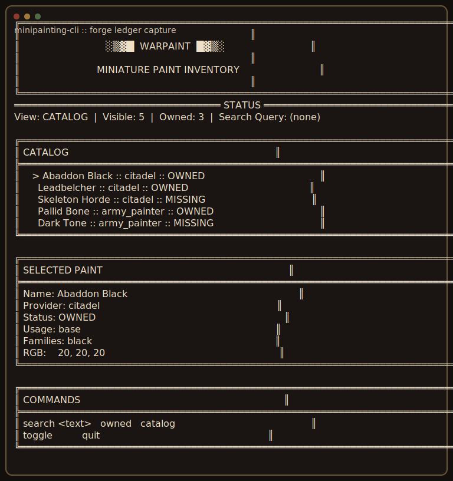
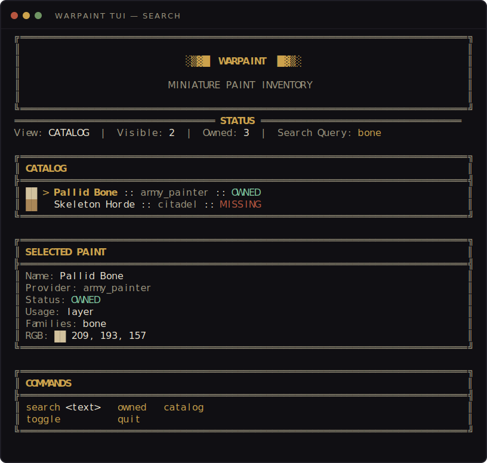
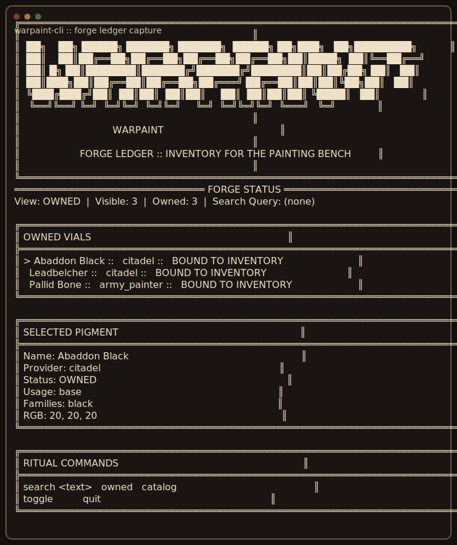
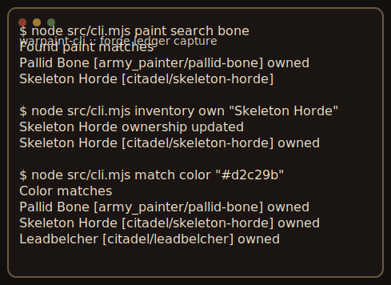

# MINIPAINTER

> The paint bench, indexed.

Site: [arturskowronski.github.io/warpaint-cli](https://arturskowronski.github.io/warpaint-cli/)

`minipainter` is a local-first paint registry for miniature-painting workflows. It exists for one practical reason: AI paint suggestions are much more useful when they understand the paints you actually own.

The project gives you:

- a deterministic local catalog (1,607 paints across Citadel, Army Painter, Vallejo, AK) and inventory
- owned-first paint lookup and cross-brand color matching
- a colored terminal UI (TUI) that shows each paint's real RGB as a swatch
- MCP servers for both Claude Desktop and ChatGPT
- a CLI surface designed for both humans and agent workflows

## New in v0.4 — colored UI

The ledger TUI is now a real colored terminal app: a `MINIPAINTER` banner, gold section
frames, green `OWNED` / red `MISSING` status, and a truecolor swatch of every paint's own
RGB. Color turns on for a TTY and honors `NO_COLOR`.



## Why This Exists

Most paint advice workflows break at the same point: they recommend paints you do not have on hand.

`minipainter` is built to solve that exact problem:

- keep a local record of what is in your paint rack
- search it quickly by name, role, family, and approximate color
- prepare a stable inventory foundation for a future AI skill that can inspect links, photos, and model images

The long-term goal is not “AI picks random colors for miniatures.” The goal is “AI reasons from your actual inventory first, then suggests stronger alternatives only when useful.”

## Feature Highlights

- `Owned-first matching`: lookups and recommendations can prioritize paints you already have.
- `Catalog in repo, inventory in your home`: paint records live in `data/catalog/`; what you own lives in `~/.minipainting/inventory.json` and follows you across projects.
- `RGB-aware search`: approximate RGB values help with nearest-color matching.
- `Colored TUI`: terminal ledger with per-paint RGB swatches and OWNED/MISSING status.
- `Agent-friendly CLI`: deterministic command output for AI integration (Claude + ChatGPT MCP).

## Screenshots

### Hero Screen

Full-screen TUI with banner, catalog, detail panel, and command strip.

```text
See: docs/assets/hero.txt
```


### Search View

Filtered lookup for a semantic search like `bone`.

```text
See: docs/assets/search.txt
```



### Owned View

Inventory-only presentation focused on what is already bound to your collection.

```text
See: docs/assets/owned.txt
```



### CLI Flow

Representative command-line usage for search, ownership updates, and color matching.

```text
See: docs/assets/cli.txt
```



## Run with Docker (Postgres)

The whole stack — MCP/HTTP server plus a Postgres that stores your inventory — starts with
one command. Inventory persists in a named volume, so it **survives container restarts and
`docker compose down` / recreation** (only `down -v` wipes it).

```bash
docker compose up --build        # http://localhost:3000
```

- `GET /health` — liveness
- `GET /api/inventory` — owned paints (from Postgres)
- `POST /mcp` — MCP for Claude Desktop · `POST /mcp/v3` — MCP for ChatGPT (`search`/`fetch`)

Storage is selected by `DATABASE_URL`: set it (as `docker-compose.yml` does) for Postgres,
leave it unset to use a local JSON inventory file (unchanged local behavior). See `.env.example`.

## Deploy

Any Docker + Postgres host works (Fly.io, Railway, a VPS…). For a one-click remote MCP
server with a managed database, the repo ships a **Render Blueprint** (`render.yaml`) that
provisions the web service and Postgres together and wires `DATABASE_URL` automatically:

[](https://render.com/deploy?repo=https://github.com/arturskowronski/warpaint-cli)

The reference deployment `warpaint-mcp.fly.dev` runs on Fly.io with Fly Managed Postgres — see
[`docs/deploy-fly.md`](docs/deploy-fly.md) for the `fly mpg attach` + migration steps.

## Install

The fastest way — run it straight from npm with `npx`, no clone, no install:

```bash
npx minipainter paint search bone
npx minipainter match color "#d2c29b"
npx minipainter tui
```

Or install it globally to get the short `mpaint` command everywhere:

```bash
npm install -g minipainter
mpaint paint search bone
mpaint --help
```

The catalog is bundled, so search and matching work on first run with nothing to configure. Your inventory lives at `~/.minipainting/inventory.json`, created automatically the first time you mark a paint owned (legacy `~/.warpaint/` is auto-migrated).

Requirements:

- Node.js 18 or newer
- POSIX-ish shell (Linux, macOS, WSL)

### From source

To hack on it, clone and run against the working tree:

```bash
git clone https://github.com/ArturSkowronski/warpaint-cli.git
cd warpaint-cli
npm install
node src/cli.mjs paint search bone
```

After that you have four usage modes:

- **CLI / TUI** — see Quickstart below
- **Self-hosted HTTP server** — a single Docker-friendly runtime with JSON storage and API endpoints
- **Local MCP for Claude Desktop** — see [Claude Desktop MCP Setup](#claude-desktop-mcp-setup)
- **Remote MCP for Claude mobile/web** — see [Remote MCP](#remote-mcp-claude-mobile)

## Quickstart

Initialize the local inventory at `~/.minipainting/inventory.json`:

```bash
node src/cli.mjs catalog sync
```

Search paints:

```bash
node src/cli.mjs paint search black
node src/cli.mjs paint search bone --json
```

Inspect one paint:

```bash
node src/cli.mjs paint show "Abaddon Black" --json
```

Mark paints as owned or missing:

```bash
node src/cli.mjs inventory own "Abaddon Black"
node src/cli.mjs inventory unown "Abaddon Black"
node src/cli.mjs inventory list
```

Run semantic or color matching:

```bash
node src/cli.mjs match describe bone
node src/cli.mjs match color "#d2c29b"
```

Launch the TUI:

```bash
node src/cli.mjs tui
```

Run the MCP server locally:

```bash
node src/mcp-server.mjs
```

Run the self-hosted HTTP server locally:

```bash
DATA_DIR=.minipainting-data node src/mcp-http-server.mjs
```

## TUI Workflow

The TUI is centered around three presentation areas:

- `FORGE CATALOG`: visible paints in the current scope
- `SELECTED PIGMENT`: the currently highlighted paint with provider, families, usage, and RGB
- `RITUAL COMMANDS`: the command legend for the active session

Current TUI commands:

- `search <text>`
- `owned`
- `catalog`
- `toggle`
- `quit`

Recommended use:

1. start with `catalog`
2. narrow with `search bone`, `search black`, or similar queries
3. inspect the selected pigment panel
4. toggle ownership as your collection changes

## Project Direction

Implemented now:

- local JSON registry
- starter provider catalogs for Citadel and Army Painter
- owned / missing inventory tracking
- deterministic search and color matching
- colored terminal presentation with per-paint swatches
- local MCP server for Claude Desktop

Planned later:

- a separate skill for parsing paint-set links
- image-driven inventory fill from paint bottle photos
- model-photo analysis that recommends owned paints first
- stronger cross-provider equivalents and matching hints

## Technical Notes

- Built-in catalog data lives in `data/catalog/` (Citadel and Army Painter, kept in version control)
- Inventory file: `~/.minipainting/inventory.json` — stores only owned paint ids in the form `{ "version": 1, "owned": ["citadel/abaddon-black", ...] }`
- Self-hosted server data directory: `DATA_DIR` (defaults to `/data` in Docker); inventory lives at `<DATA_DIR>/inventory.json`
- The catalog and inventory are composed at runtime; saving never rewrites the catalog
- IDs are stable by convention (provider + name slug); on load, owned ids missing from the catalog are reported as warnings instead of being silently dropped
- A pre-existing project-local `.minipainting/registry.json` next to the inventory path is auto-migrated on first run
- Legacy `.warpaint/` data directories are auto-renamed to `.minipainting/` on first run (both home and project-local variants)
- Override the inventory location at the API surface with `{ inventoryPath }` or `{ cwd }` (the latter resolves to `<cwd>/.minipainting/inventory.json`, which is what the test suite uses for isolation)
- RGB values are approximate reference colors for matching, not a guarantee of final painted appearance
- MCP entrypoint: `node src/mcp-server.mjs`
- MCP helper script: `npm run mcp`
- HTTP server helper script: `npm run server`
- README demo captures are reproducible via:

```bash
npm run generate:demo
```

## Claude Desktop MCP Setup

`minipainter` now includes a local MCP server so Claude Desktop can use your paint registry directly.

Example local MCP config:

```json
{
  "mcpServers": {
    "minipainter": {
      "command": "node",
      "args": ["/absolute/path/to/warpaint-cli/src/mcp-server.mjs"]
    }
  }
}
```

After adding the server, Claude Desktop can call tools such as:

- `paint_search`
- `paint_show`
- `inventory_list`
- `inventory_mark_owned`
- `inventory_mark_unowned`
- `match_color`
- `match_describe`

Suggested local flow:

1. initialize your registry once with `node src/cli.mjs catalog sync`
2. add the MCP server to Claude Desktop
3. ask Claude to search paints or update ownership through the exposed tools

## Self-Hosted Docker

The Docker image runs a single HTTP server runtime designed for self-hosted use:

```bash
docker run -p 3000:3000 -v minipainting-data:/data ghcr.io/ArturSkowronski/warpaint-cli
```

The server exposes:

- `GET /health`
- `GET /api/paints`
- `GET /api/paints/:paint`
- `GET /api/inventory`
- `PUT /api/inventory/:paint`
- `DELETE /api/inventory/:paint`
- `POST /api/match/color`
- `POST /api/match/describe`
- `POST /mcp`

Optional runtime configuration:

- `PORT` — listen port, defaults to `3000`
- `DATA_DIR` — persistent state directory, defaults to `/data` in Docker
- `AUTH_TOKEN` — protects `/api/*` and `/mcp` with `Authorization: Bearer ...`
- `INVENTORY_SYNC_TOKEN` — protects the legacy `/inventory` sync endpoint

## Remote MCP (Claude Mobile)

For Claude mobile or web, the stdio MCP server above is not reachable. Run
`minipainter-mcp-http` instead — a Streamable HTTP MCP transport exposing the
same tools, plus `GET`/`POST /inventory` for syncing the local inventory.

### Local smoke test

```bash
export INVENTORY_SYNC_TOKEN=$(openssl rand -hex 32)
export PORT=3000
export INVENTORY_PATH=$HOME/.minipainting/inventory.json
npm run mcp:http
```

Then in another shell:

```bash
curl -s http://localhost:3000/health
curl -s -X POST http://localhost:3000/mcp \
  -H "Content-Type: application/json" \
  -H "Accept: application/json, text/event-stream" \
  -d '{"jsonrpc":"2.0","id":1,"method":"tools/list"}'

# Sync endpoint (bearer-token protected)
curl -s -H "Authorization: Bearer $INVENTORY_SYNC_TOKEN" \
     http://localhost:3000/inventory
```

### Deploy to Fly.io

The repo ships a `Dockerfile` and `fly.toml`. Full recipe in
[docs/deploy-fly.md](docs/deploy-fly.md). Short version:

```bash
fly launch --no-deploy --copy-config --name <your-app-name>
fly volumes create inventory_data --region <your-region> --size 1
fly secrets set INVENTORY_SYNC_TOKEN="$(openssl rand -hex 32)"
fly deploy
```

### Connect Claude

In Claude (mobile or web), add a custom connector:

- URL: `https://<your-app-name>.fly.dev/mcp`

The `/mcp` endpoint currently has no authentication — anyone with the URL can
call tools. Use the obscurity of the URL plus Fly's network controls for now;
add per-user auth before sharing the URL.

### Environment variables

| Variable | Required | Purpose |
|---|---|---|
| `INVENTORY_SYNC_TOKEN` | for `/inventory` | Bearer token protecting `GET`/`POST /inventory`; when unset, sync returns 503 |
| `INVENTORY_PATH` | no | Path to `inventory.json`; default `~/.minipainting/inventory.json` locally, `/data/inventory.json` in the Docker image |
| `INVENTORY_JSON` | no | One-time seed JSON; only used when `INVENTORY_PATH` is absent on first boot |
| `WARPAINT_INVENTORY_JSON` | no | Legacy alias of `INVENTORY_JSON` |
| `MCP_SERVER_NAME` | no | Server name in MCP handshake + startup log; default `paint-inventory` |
| `PORT` | no (default `3000`) | TCP port to listen on |

### Known limitations

- `/mcp` has no authentication yet. The bearer token only protects `/inventory`.
- Stateless transport: no long-running SSE tool streams (the tools are
  fast so this is fine).

## Self-hosting your own MCP

The MCP server is generic — only the CLI (`mpaint`) is branded. To run your
own instance:

1. Fork or clone the repo.
2. (Optional) rename your Fly app in `fly.toml`.
3. Create a Fly volume and set secrets:

   ```bash
   fly volumes create inventory_data --size 1 --region <your-region>
   fly secrets set INVENTORY_SYNC_TOKEN=$(openssl rand -hex 24)
   # Optional one-time seed:
   fly secrets set INVENTORY_JSON="$(cat ~/.minipainting/inventory.json)"
   ```

4. (Optional) name your MCP server (shown in the MCP handshake and startup
   logs):

   ```bash
   fly secrets set MCP_SERVER_NAME=my-paints
   ```

5. Deploy:

   ```bash
   fly deploy
   ```

6. Register the remote in your local CLI and sync:

   ```bash
   mpaint sync add default \
     --url https://my-app.fly.dev \
     --token <token-from-step-3>
   mpaint sync push
   ```

After this, your local inventory and the deployed MCP stay in sync via
`mpaint sync push` (upload local → remote) and `mpaint sync pull --force`
(overwrite local from remote).

## License

[MIT](LICENSE) © Artur Skowronski
